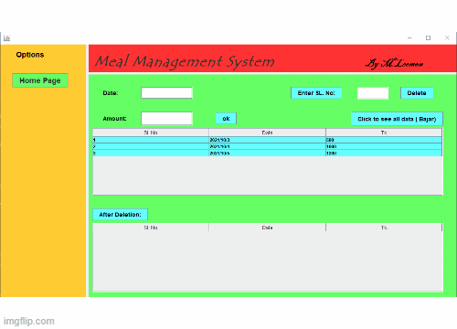

[![Contributors][contributors-shield]][contributors-url]
[![Forks][forks-shield]][forks-url]
[![Stargazers][stars-shield]][stars-url]
[![Issues][issues-shield]][issues-url]
[![MIT License][license-shield]][license-url]

<!-- PROJECT LOGO -->
 

  

  <h3 align="center">Meal Management System </h3>

<!-- ABOUT THE PROJECT-->
## About The Project

This is a GUI based project to manage a typical hostel in Dhaka city. Where students live together and manages everything. This is a small project to maintain their accounts for the hostel.

(<a href="#top">back to top</a>)

---
## Features: 
  * Show All inforamtion to all. 
  * Authentication for admin.
  * Add daily number of meals.
  * Add missing date meals.
  * Add / Delete grocery total amount
  * Show total meal of each member, meal rate,
  * Clean all Data. 
  * Dashboard. 
  * The amount of money need to pay end of the month.
  

(<a href="#top">back to top</a>)

  
---
## Built With
* Java Swing.
* Java GUI.
* Neatbeans.

(<a href="#top">back to top</a>)

<!-- MARKDOWN LINKS & IMAGES -->
<!-- https://www.markdownguide.org/basic-syntax/#reference-style-links -->
[contributors-shield]: https://img.shields.io/github/contributors/othneildrew/Meal-Management-System-Java-Swing-GUI.svg?style=for-the-badge
[contributors-url]: https://github.com/othneildrew/Meal-Management-System-Java-Swing-GUI/graphs/contributors
[forks-shield]: https://img.shields.io/github/forks/othneildrew/Meal-Management-System-Java-Swing-GUI.svg?style=for-the-badge
[forks-url]: https://github.com/othneildrew/Meal-Management-System-Java-Swing-GUI/network/members
[stars-shield]: https://img.shields.io/github/stars/othneildrew/Meal-Management-System-Java-Swing-GUI.svg?style=for-the-badge
[stars-url]: https://github.com/othneildrew/Meal-Management-System-Java-Swing-GUI/stargazers
[issues-shield]: https://img.shields.io/github/issues/othneildrew/Meal-Management-System-Java-Swing-GUI.svg?style=for-the-badge
[issues-url]: https://github.com/othneildrew/Meal-Management-System-Java-Swing-GUI/issues
[license-shield]: https://img.shields.io/github/license/othneildrew/Meal-Management-System-Java-Swing-GUI.svg?style=for-the-badge
[license-url]: https://github.com/othneildrew/Meal-Management-System-Java-Swing-GUI/blob/master/LICENSE.txt

[product-screenshot]: assets/project.gif
